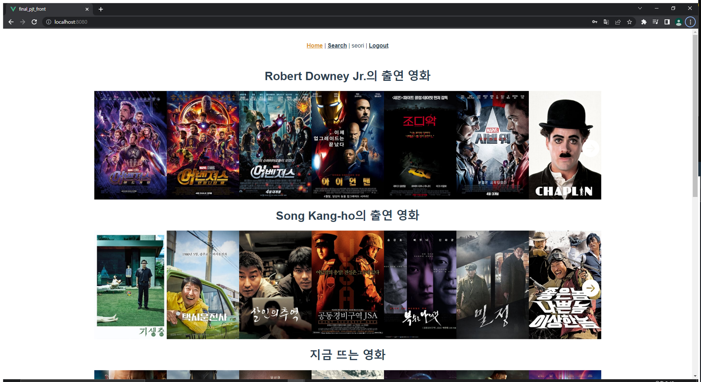

# Project_Movie_of_My_Life

사용자들에게 영화를 추천해주고 서로 영화 후기를 공유하는 웹 커뮤니티입니다.

# 개발 의도 및 작품 설명

---

**‘팔로우에 기반하여 영화를 추천해주는 알고리즘’ + ‘유저 간 커뮤니티 기능’**

우리는 좋아하는 감독이나 배우가 등장하는 영화를 즐겨봅니다. 그러나 영화 OTT 서비스의 영화 추천 기능은 인기순으로 영화를 보여주기 때문에, 영화를 따로 검색해서 찾아봐야 합니다.

이러한 사용자의 니즈에 맞게 영화를 추천해줄 수 없을까 고민하다가, 영화 추천 알고리즘 개선을 주제로 선정하였습니다. 또한 비슷한 취향의 유저들끼리 서로 영화를 추천해줄 수 있도록 커뮤니티 기능을 추가할 수 있게 아이디어를 구상하였습니다.

자신의 마음에 드는 영화 배우 혹은 감독, 장르를 팔로우할 수 있고 저희 서비스는 이와 기존의 평점 정보를 기반하여 영화를 추천합니다.

저희는 특정 기간 내의 프로젝트 완성을 계획하였지만 개발 내의 추후 확장을 고려하여 프로젝트 설계를 진행하였습니다. 전체적인 구현에서 가장 초점을 둔 부분은 영화 데이터가 쌓이더라도 버벅이지 않고 최적화된 서비스를 제공 하는 것이었습니다.

